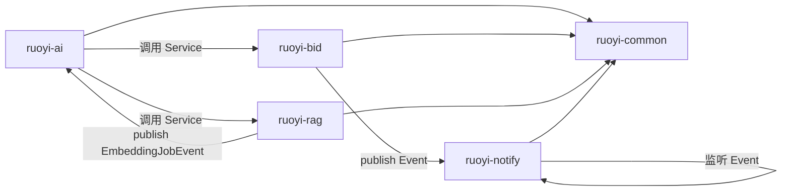

---
tags:
  - PGI
  - 技术
  - 架构
aliases:
  - 技术结构
  - 技术架构
  - 系统架构
---

# 技术结构

本文档完整阐述 PGI 系统的技术栈选型、整体架构设计、模块划分与依赖关系、关键技术决策，以及前后端协作方式。适合技术负责人、架构师和开发人员理解系统"用了什么技术、怎么组装、为什么这么设计"。

## 一、技术栈总览

### 1.1 后端技术栈

| 层级 | 技术 | 版本 | 选型理由 |
|------|------|------|---------|
| JDK | OpenJDK | 21 | LTS 长期支持，支持虚拟线程、模式匹配等新特性 |
| 后端框架 | Spring Boot | 4.0.6 | 主流企业级框架，生态成熟，与 Spring AI 原生集成 |
| AI 框架 | Spring AI | 2.0.0 | 原生支持 ChatClient / @Tool / Advisor / 向量存储，与 Spring Boot 4.0 深度集成 |
| ORM | MyBatis + PageHelper | 4.0.1 | SQL 透明可控，符合招标业务对数据精确性的要求 |
| 数据库连接池 | Druid | 1.2.28 | 高性能 + 内置 SQL 监控面板 |
| 安全框架 | Spring Security + JWT | — | 无状态认证，支持多终端（Web/App/小程序） |
| 缓存 | Redis (Lettuce) | 7.x | 高性能缓存 / Session / Token / AI 短期记忆 |
| 业务数据库 | MySQL | 8.4 | 主流关系型数据库，支持窗口函数、CTE 等 |
| 向量数据库 | ChromaDB | 1.5.9 | 轻量级向量库，Spring AI 原生支持，单机部署友好 |
| 大模型 | DeepSeek (OpenAI 兼容) | deepseek-chat | 高性价比，中文效果好，切换模型成本极低 |
| Embedding | 智谱 embedding-2 | 1024 维 | 中文向量化效果好，OpenAI 兼容接口 |
| 文档解析 | Apache Tika | 2.9.1 | 支持 PDF / Word / Markdown / TXT / Excel 等多种格式 |
| HTML 解析 | Jsoup | 1.17.2 | 资讯爬虫模块使用（已移除，保留依赖以备恢复） |
| JSON | FastJSON2 | 2.0.62 | 高性能 JSON 序列化/反序列化 |
| API 文档 | springdoc-openapi | 3.0.3 | OpenAPI 3 规范，替代旧版 Swagger |
| 邮件 | spring-boot-starter-mail | — | JavaMailSender 异步发送 |

### 1.2 前端技术栈

| 层级 | 技术 | 版本 | 选型理由 |
|------|------|------|---------|
| 前端框架 | Vue 3 | 3.5.26 | 渐进式框架，组合式 API，性能优秀 |
| 构建工具 | Vite | 6.4.1 | 极速冷启动 + HMR，开发体验好 |
| UI 组件库 | Element Plus | 2.13.1 | 企业级中后台组件库，与 Vue 3 深度集成 |
| 状态管理 | Pinia | 3.0.4 | Vue 3 官方推荐，TypeScript 友好 |
| 路由 | Vue Router | 4.x | Vue 3 官方路由 |
| HTTP 客户端 | Axios | — | 拦截器 / 重试 / 错误处理 |
| SSE 工具 | 原生 fetch + ReadableStream | — | 流式对话，支持中途取消 |

完整选型理由见 [[技术栈总览]]。

## 二、系统整体架构

### 2.1 分层架构

系统采用经典的四层架构，每层职责清晰、不可越界：

```
┌─────────────────────────────────────────────────────────┐
│                    前端表现层                             │
│   Vue 3 + Element Plus / Pinia / SSE 流式对话            │
│   AI 对话组件 / 权限指令 / 业务页面                       │
└────────────────────────┬────────────────────────────────┘
                         │ HTTP / SSE (JWT 鉴权)
┌────────────────────────▼────────────────────────────────┐
│                  接口接入层 (ruoyi-admin)                 │
│   Controller 接收请求 / 参数校验 / 调用 Service           │
│   禁止直接操作数据库 / 禁止跨模块调用其他 Controller      │
└────────────────────────┬────────────────────────────────┘
                         │
   ┌─────────────────────┼─────────────────────┐
   ▼                     ▼                     ▼
┌──────────┐       ┌──────────────┐      ┌──────────────┐
│  业务层   │       │    AI 层      │      │   基础层      │
│          │◄──────│              │      │              │
│ ruoyi-bid│       │ ruoyi-ai     │      │ ruoyi-common │
│ ruoyi-   │       │ ruoyi-rag    │      │ ruoyi-system │
│  notify  │       │              │      │ ruoyi-       │
│          │       │              │      │  framework   │
│          │       │              │      │ ruoyi-quartz │
└────┬─────┘       └──────┬───────┘      └──────────────┘
     │                    │
     │  跨模块仅通过       │ AI 可调用所有
     │  Service 接口       │ 业务 Service
     │                    │
     └────────┬───────────┘
              ▼
   ┌─────────────────────┐
   │      存储层           │
   │  MySQL (业务+AI元数据)│
   │  Redis (缓存+短期记忆)│
   │  ChromaDB (向量数据)  │
   └─────────────────────┘
```

### 2.2 层级职责与边界

| 层 | 职责 | 不可越界 |
|----|------|---------|
| **Controller** | 接收请求、参数校验（`@Valid`）、调用 Service、组装响应 | 禁止直接操作数据库；禁止跨模块调用其他 Controller |
| **Service** | 业务逻辑、状态机校验、规则校验、事务管理 | 禁止跨模块调 Mapper；循环依赖用事件解耦 |
| **Mapper** | 数据持久化（MyBatis XML） | 禁止含业务逻辑；查询加 `del_flag='0'`；更新加 `version` 乐观锁 |
| **Entity** | 数据载体（DTO/VO/Domain） | 禁止含行为逻辑；审计字段继承 BaseEntity |

## 三、模块拓扑与依赖关系

### 3.1 模块拓扑图

```
ruoyi-admin (启动装配入口, 端口 8080)
  ├── ruoyi-framework  → ruoyi-system → ruoyi-common (基础层)
  ├── ruoyi-quartz     → ruoyi-common (定时任务)
  ├── ruoyi-bid        → ruoyi-common (招标业务, 含状态机+规则引擎)
  ├── ruoyi-ai         → ruoyi-common + ruoyi-system + spring-ai-openai (AI智能体)
  ├── ruoyi-rag        → ruoyi-ai + spring-ai-chroma + tika (RAG知识库)
  └── ruoyi-notify     → ruoyi-common + spring-mail (消息通知)
```

### 3.2 Maven 依赖关系

| 模块 | 依赖 |
|------|------|
| ruoyi-bid | ruoyi-common |
| ruoyi-ai | ruoyi-common, ruoyi-system, spring-ai-starter-model-openai |
| ruoyi-rag | ruoyi-ai, spring-ai-starter-vector-store-chroma, tika-core, tika-parsers-standard-package |
| ruoyi-notify | ruoyi-common, spring-boot-starter-mail |
| ruoyi-admin | 所有业务模块 + springdoc |

### 3.3 跨模块调用铁律

这是架构设计的核心约束，违反即架构违规：

| 规则编号 | 规则 | 实现方式 |
|---------|------|---------|
| MB-R01 | 跨模块调用必须通过 Service 接口，禁止 Mapper 跨模块互调 | Spring 依赖注入 `@Autowired` 其他模块的 `IXxxService` |
| MB-R02 | Controller 禁止直接操作数据库，禁止跨模块调用其他 Controller | Controller 仅调用本模块 Service |
| MB-R03 | 循环依赖禁止：A 调 B 则 B 不可调 A | 通过事件机制（ApplicationEvent）解耦 |
| MB-R04 | AI 模块（M13）调用业务模块必须通过 Service 接口 + 权限校验 | 工具实现中注入业务 Service，执行前校验当前用户权限 |
| MB-R05 | 知识库模块（M14）与 AI 模块（M13）双向依赖通过事件解耦 | M14 发 `EmbeddingJobEvent`，M13 监听执行向量化 |
| MB-R06 | 通知模块（M15）仅接收事件，不主动调用业务模块 | 业务模块 publish `NotifyEvent`，M15 监听发送 |

### 3.4 模块依赖矩阵（规范 1.2 节）

| 调用方模块 | 允许调用的被调方模块（仅限 Service 接口） | 禁止直接操作的其他模块表 |
|-----------|---------------------------------------|----------------------|
| M02 project | M09 attachment, M10 audit, M12 venue, M15 notify | M03~M08 所有表 |
| M03 notice | M02 project, M09 attachment, M10 audit, M15 notify | M04~M08 所有表 |
| M04 document | M02 project, M09 attachment, M10 audit | M03, M05~M08 所有表 |
| M05 bid | M02 project, M04 document, M08 qualification, M09 attachment, M11 deposit, M15 notify | M03, M06, M07 所有表 |
| M06 evaluation | M02 project, M05 bid, M09 attachment, M15 notify | M03, M04, M07, M08 所有表 |
| M07 award | M02 project, M05 bid, M06 evaluation, M09 attachment, M10 audit, M15 notify | M03, M04, M08 所有表 |
| M13 ai | M02~M12 所有模块 Service, M14 knowledge | 禁止直接操作任何业务模块表，必须通过 Service |
| M14 knowledge | M09 attachment, M13 ai | 所有业务模块表 |
| M15 notify | M01 sys | 所有业务模块表 |

详见 [[架构设计]] 和 [[核心模块详解]]。

## 四、9 大核心模块

### 4.1 模块清单

| # | 模块 | 性质 | 职责一句话 | 状态 |
|---|------|------|-----------|------|
| 1 | `ruoyi-admin` | 启动入口 | Spring Boot 装配入口，20+ 系统级 Controller | ✅ 完整 |
| 2 | `ruoyi-common` | 基础层 | 工具/注解/异常/常量/状态机引擎 | ✅ 完整 |
| 3 | `ruoyi-system` | 系统管理 | 用户/角色/菜单/字典（复用若依标准） | ✅ 完整 |
| 4 | `ruoyi-framework` | 框架核心 | Security/JWT/AOP/动态数据源/全局异常 | ✅ 完整 |
| 5 | `ruoyi-quartz` | 定时任务 | Quartz 任务调度 | ✅ 完整 |
| 6 | `ruoyi-bid` | 招标业务 | 招标全生命周期（14 张表） | 🚧 脚手架 |
| 7 | `ruoyi-ai` | AI 智能体 | 对话/工具调用/记忆/用量审计 | 🚧 脚手架 |
| 8 | `ruoyi-rag` | RAG 知识库 | 文档解析/分块/向量化/检索 | 🚧 脚手架 |
| 9 | `ruoyi-notify` | 消息通知 | 站内信/邮件/事件驱动 | 🚧 脚手架 |

每个模块的内部结构、子包划分、核心类清单详见 [[核心模块详解]]。

### 4.2 模块协作关系图



## 五、关键技术决策

### 5.1 AI Native 架构

采用 Spring AI 2.0 作为 AI 集成框架，而非 LangChain4j 或自研封装。理由：
- 与 Spring Boot 4.0 原生集成，无需额外桥接层
- 原生支持 `ChatClient`（对话）、`@Tool`（工具调用）、`Advisor`（拦截器链）、`VectorStore`（向量存储）
- 通过 OpenAI 兼容接口接入 DeepSeek，切换模型只需改配置，无需改代码

### 5.2 双端点解耦

对话模型用 DeepSeek，向量化模型用智谱 embedding-2，二者端点不同。通过自定义 `EmbeddingConfig` 以 `@Primary` 覆盖自动配置，实现 chat 与 embedding 各走各的端点。详见 [[项目创建过程]] 和 [[RAG知识库]]。

### 5.3 全链路状态机

9 个状态机覆盖所有核心业务实体，状态流转由 `StateMachineEngine` 统一校验，禁止直接 update status。详见 [[状态机设计]]。

### 5.4 120 条业务规则编号化

业务规则编号化（BR001-BR120），直接映射代码校验逻辑。法规级硬约束（公示期、专家数、报价上限）在代码层强制执行。详见 [[业务规则体系]]。

### 5.5 6 种幂等方案

| 方案 | 适用场景 | 实现方式 |
|------|---------|---------|
| requestId | 前端每次请求带唯一 requestId | 后端 Redis SETNX 去重 |
| MD5 去重 | 文件上传 | 附件 MD5 一致则复用 |
| 防重 Token | 表单提交 | 提交前申请 Token，提交时校验销毁 |
| 状态机 | 状态流转 | DRAFT→SUBMITTED 只能一次 |
| 唯一索引 | 项目编号、证书编号 | 数据库层防重 |
| 分布式锁 | 集群并发 | Redisson 锁 |

### 5.6 AI 操作审计与回滚

写操作需确认 + before/after 快照 + 支持回滚。详见 [[工具调用体系]]。

### 5.7 原生 MyBatis 而非 MyBatis-Plus

SQL 透明可控，符合招标业务对数据精确性的要求。乐观锁、逻辑删除、审计字段均手动实现，每条 SQL 可审计。详见 [[项目创建过程]] 决策 2。

### 5.8 事件驱动解耦

知识库 ↔ AI 双向依赖、业务模块 → 通知模块，均通过 ApplicationEvent 解耦。详见 [[架构设计]]。

## 六、前端架构

### 6.1 目录结构

| 目录 | 用途 |
|------|------|
| `api/` | 接口定义（ai.js, bid.js, rag.js, project.js 等 15+ 模块） |
| `components/` | 27 个组件（AiChat, MarkdownRender, ToolCard, ProgressTimeline, StateBadge 等 AI 专用组件） |
| `store/modules/` | 8 个 Pinia store（ai.js 对话状态, permission.js 动态路由, user.js 用户信息等） |
| `views/` | 业务页面（ai/, bid/, rag/, project/ 等） |
| `utils/` | request.js(axios 封装), sse.js(SSE 流式对话), ruoyi.js, auth.js, jsencrypt.js |
| `layout/` | 整体布局（Sidebar, Navbar, TagsView, AppMain） |
| `directive/` | v-hasPermi, v-hasRole 权限指令 |
| `plugins/` | $tab, $auth, $cache, $modal, $download 全局插件 |

### 6.2 AI 对话核心实现

**SSE 流式对话**（`utils/sse.js`）：
- 基于 `fetch + ReadableStream + AbortController` 实现
- 按行解析 `data:` 字段
- 区分 `tool_call`（工具调用）与普通文本消息
- 支持中途取消（AbortController.abort()）

**对话状态管理**（`store/modules/ai.js`）：
- `conversationList`：会话列表
- `messageList`：当前会话消息列表
- `streaming`：流式输出状态
- `toolCalling`：工具调用状态

**AI 对话组件**（`components/AiChat`）：
- `MessageList`：消息列表（滚动容器）
- `MessageBubble`：单条消息气泡（用户/AI/工具）
- `MessageInput`：输入框（文本 + 文件上传）
- `ToolCard`：工具调用卡片（展示工具名/参数/状态/结果）
- `MarkdownRender`：AI 回复 Markdown 渲染（markdown-it + highlight.js）

### 6.3 权限系统

| 层级 | 机制 | 说明 |
|------|------|------|
| 路由守卫 | `permission.js` | Token 检测 → 用户信息 → 动态路由生成 → 锁屏检测 |
| 指令级 | `v-hasPermi`, `v-hasRole` | 无权限移除 DOM |
| 函数级 | `checkPermi()`, `hasRole()` | 支持 `*:*:*` 超管通配 |

### 6.4 前后端协作

- 前端通过 Vite 代理：`.env.development` 中 `VITE_APP_BASE_API=/dev-api`，`vite.config.js` 将 `/dev-api` 代理到 `http://localhost:8080`
- 统一请求封装：`utils/request.js` 基于 Axios，含拦截器（Token 注入）/ 重试 / 错误处理
- 统一响应结构：`{ code: 200, msg: "操作成功", data: { ... } }`

## 七、数据存储设计

### 7.1 三类存储分工

| 存储 | 用途 | 表/Key 数量 |
|------|------|-----------|
| MySQL | 业务数据 + AI 元数据 | 55 张表 |
| Redis | 缓存 / Session / Token / AI 短期记忆 | 多个 Key 命名空间 |
| ChromaDB | 向量数据（RAG） | 1 个 Collection（pgi_knowledge） |

### 7.2 Redis Key 命名空间

| Key 前缀 | 用途 | TTL |
|---------|------|-----|
| `login_tokens:{uuid}` | 登录 Token | 30 分钟 |
| `sys_config:{configKey}` | 系统配置缓存 | 永久 |
| `pwd_err_cnt:{username}` | 密码错误次数 | 10 分钟 |
| `ai:memory:short:{conversationId}` | AI 短期记忆（20 轮） | 24 小时 |
| `idempotent:{requestId}` | 幂等去重 | 600 秒 |

详见 [[数据库设计]]。

## 八、配置文件体系

### 8.1 后端配置

| 配置文件 | 内容 | Profile |
|----------|------|---------|
| `application.yml` | 主配置（端口 8080, Redis, MyBatis, Token, XSS） | 默认 |
| `application-druid.yml` | 数据源配置（MySQL pgi 库） | druid |
| `application-ai.yml` | AI 模块配置（DeepSeek + ChromaDB + 智谱 embedding + 业务参数） | ai |

`application.yml` 中通过 `spring.profiles.active: druid` 和 `spring.profiles.include: ai` 激活数据源和 AI 模块。

### 8.2 前端配置

| 配置文件 | 内容 |
|----------|------|
| `.env.development` | `VITE_APP_BASE_API=/dev-api` |
| `.env.production` | `VITE_APP_BASE_API=/prod-api` + gzip |
| `vite.config.js` | 端口 80，代理 `/dev-api` → `http://localhost:8080` |

## 九、技术亮点汇总

| 亮点 | 技术 | 价值 |
|------|------|------|
| Spring AI 2.0 原生集成 | ChatClient / @Tool / Advisor | AI 能力开箱即用，无需自研封装 |
| 双端点解耦 | DeepSeek + 智谱 embedding-2 | chat 与 embedding 各走最优端点 |
| 全链路状态机 | 9 个状态机 + StateMachineEngine | 流程严谨，杜绝人工改乱状态 |
| 120 条业务规则 | BR001-BR120 + RuleValidator | 法规级硬约束代码强制 |
| 6 种幂等方案 | requestId / MD5 / Token / 状态机 / 唯一索引 / 分布式锁 | 所有写操作防重复 |
| AI 操作审计回滚 | action_record + before/after 快照 | 让企业敢用 AI |
| SSE 流式对话 | fetch + ReadableStream + SseEmitter | 边生成边显示，体验好 |
| 短期 + 长期记忆 | Redis + MySQL | AI 记得用户偏好 |
| 用量审计 | UsageAdvisor | 精准核算 AI 成本 |
| 多租户隔离 | dept_id + @DataScope | A 公司看不到 B 公司数据 |
| 乐观锁 | version 字段 + XML WHERE | 防并发更新冲突 |
| 事件驱动解耦 | ApplicationEvent | 解决循环依赖 |
| Docker 一键部署 | docker-compose | 5 服务一条命令拉起 |

## 相关笔记
- [[01-项目创建过程]] — 这些技术是如何选定的
- [[03-角色分配]] — 谁负责哪部分技术
- [[05-亮点展示]] — 技术结构的商业价值
- [[04-使用教程]] — 如何把这套技术跑起来
- [[技术栈总览]] — 完整技术选型清单
- [[架构设计]] — 架构设计详解
- [[核心模块详解]] — 每个模块内部结构
- [[数据库设计]] — 存储层表设计
- [[部署方案]] — 部署方案详解
