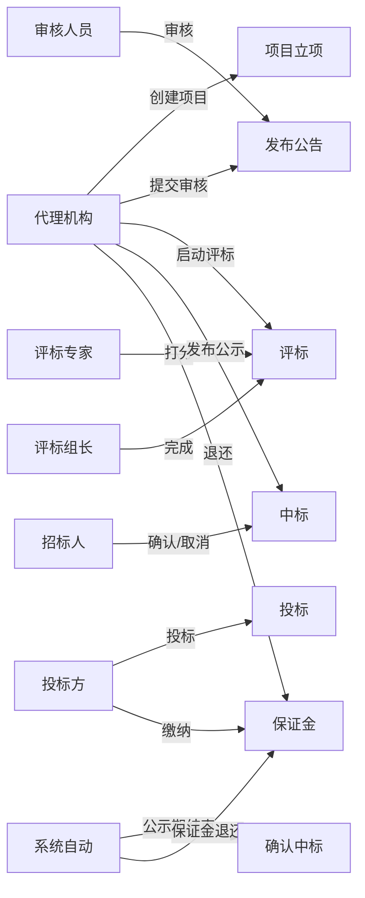

---
tags:
  - PGI
  - 团队
  - 角色
  - 权限
aliases:
  - 角色分配
  - 团队分工
  - 角色职责
---

# 角色分配

本文档详细说明 PGI 系统涉及的所有角色、每个角色的职责范围、权限边界、典型操作场景，以及角色之间的协作模式。同时阐述三层权限控制机制和多租户数据隔离方案。适合产品、运营、客户理解"谁能做什么、谁该做什么、怎么管好权限"。

## 一、角色体系总览

本项目涉及三类共 10 个角色：

| 类别 | 角色 | 数量 |
|------|------|------|
| **业务角色** | 系统管理员、代理机构、招标人、投标方、审核人员、评标专家、评标组长 | 7 |
| **AI 角色** | AI 智能体、普通用户（AI 使用者） | 2 |
| **系统角色** | 系统自动（定时任务） | 1 |

## 二、业务角色详解

### 2.1 系统管理员（admin）

| 维度 | 说明 |
|------|------|
| **核心职责** | 系统级管理、全局配置、AI 知识库管理 |
| **权限范围** | 全系统（`*:*:*` 超管通配） |
| **典型操作** | 用户/角色/菜单/字典管理、AI 知识库创建、向量化重试、文档删除、系统配置、定时任务管理、监控查看 |
| **典型场景** | 新员工入职开通账号、上传企业招标制度文档到知识库、配置系统参数、查看系统监控 |
| **关联实体** | sys_user（user_type='00' 管理员） |

#### 具体操作清单

| 操作类别 | 操作项 |
|---------|--------|
| 用户管理 | 新增/修改/删除用户、重置密码、分配角色、分配部门 |
| 角色管理 | 新增/修改/删除角色、配置菜单权限、设置数据权限范围 |
| 菜单管理 | 配置菜单树、设置按钮权限标识、调整菜单排序 |
| 字典管理 | 维护状态枚举等固定数据（如项目状态、投标状态） |
| 部门管理 | 配置组织机构树（公司/部门/小组），支撑数据权限 |
| 岗位管理 | 配置用户所属职务 |
| 参数配置 | 维护系统动态参数 |
| 通知公告 | 系统通知公告发布 |
| 定时任务 | 查看/新增/修改/删除 Quartz 任务、查看执行日志 |
| 在线用户 | 查看当前在线用户、强制下线 |
| 监控 | 服务监控（CPU/内存/磁盘）、缓存监控、操作日志、登录日志 |
| AI 知识库 | 创建知识库、上传文档、重试向量化、删除文档 |

### 2.2 代理机构（招标代理）

代理机构是招标业务的**主角**，贯穿项目全生命周期，是操作最频繁的角色。

| 维度 | 说明 |
|------|------|
| **核心职责** | 招标流程主要执行方 |
| **权限范围** | 本机构（dept_id 隔离）内的项目 |
| **关联实体** | sys_user（dept_id 关联代理机构部门） |

#### 具体操作清单（按招标流程阶段）

| 阶段 | 操作项 | 状态流转 | 关键规则 |
|------|--------|---------|---------|
| 项目立项 | 创建项目 | — | BR001 项目编号唯一 |
| 项目立项 | 提交注册 | DRAFT→REGISTERED | BR004 预算>0、BR005 截止时间需 24h 后 |
| 项目立项 | 修改项目 | — | BR003 仅 DRAFT 可编辑 |
| 公告发布 | 创建公告 | — | BR016 公告关联项目 |
| 公告发布 | 提交审核 | DRAFT→UNDER_REVIEW | BR018 公告内容完整 |
| 公告发布 | 撤回公告 | PUBLISHED→WITHDRAWN | BR028 已发布可撤回 |
| 文件管理 | 上传招标文件 | — | BR082 文件≤100MB |
| 文件管理 | 提交备案 | DRAFT→SUBMITTED | BR024 版本号正确 |
| 评标管理 | 启动评标 | PENDING→IN_PROGRESS | BR046 专家≥3 人且奇数 |
| 评标管理 | 中止评标 | IN_PROGRESS→ABORTED | BR058 记录中止原因 |
| 中标管理 | 发布中标公示 | DRAFT→PUBLISHED | BR059 评标已完成、BR061 中标金额=投标报价 |
| 保证金 | 退还保证金 | PAID→REFUNDED | BR103 未中标方 |
| 保证金 | 没收保证金 | PAID→FORFEITED | BR104 违规方 |
| 场地预约 | 预约场地 | — | BR105 时间冲突校验 |
| 场地预约 | 变更/取消 | PENDING/CONFIRMED→CANCELED | BR110 记录原因 |

详见 [[招标全流程]]。

### 2.3 招标人（项目业主）

招标人是关键决策方，操作不多但都是关键节点。

| 维度 | 说明 |
|------|------|
| **核心职责** | 关键决策 |
| **权限范围** | 本单位项目 |
| **典型场景** | 项目因故终止、中标结果有异议需取消 |

#### 具体操作清单

| 操作项 | 状态流转 | 关键规则 |
|--------|---------|---------|
| 终止项目 | *→TERMINATED | BR015 仅特定状态可终止 |
| 取消中标 | PUBLISHED→CANCELED | BR070 记录取消原因 |
| 确认中标（部分场景） | PUBLISHED→CONFIRMED | — |

### 2.4 投标方（投标企业）

投标方是投标主体，围绕投标和资质展开操作。

| 维度 | 说明 |
|------|------|
| **核心职责** | 投标主体 |
| **权限范围** | 本企业的投标和资质 |
| **关联实体** | pgi_bidder（link_user_id 关联 sys_user） |

#### 具体操作清单

| 阶段 | 操作项 | 状态流转 | 关键规则 |
|------|--------|---------|---------|
| 投标 | 我要投标 | — | BR029 同项目仅投一次 |
| 投标 | 缴纳保证金 | — | BR035 投标前需缴保证金 |
| 投标 | 提交投标 | DRAFT→SUBMITTED | BR033 报价≤预算、BR031 截止前提交 |
| 投标 | 撤回投标 | DRAFT→WITHDRAWN | BR030 仅 DRAFT 可撤回 |
| 投标 | 上传投标文件 | — | BR082 文件≤100MB |
| 资质 | 新增资质 | — | BR072 证书编号唯一 |
| 资质 | 提交审核 | DRAFT→SUBMITTED | BR073 资质文件已上传 |
| 资质 | 续期 | EXPIRED→SUBMITTED | BR079 更新有效期 |

### 2.5 审核人员

| 维度 | 说明 |
|------|------|
| **核心职责** | 各类审核 |
| **权限范围** | 分配的审核任务 |
| **关联实体** | pgi_audit_log |

#### 具体操作清单

| 审核类型 | 操作项 | 状态流转 | 关键规则 |
|---------|--------|---------|---------|
| 公告审核 | 审核通过 | UNDER_REVIEW→PUBLISHED | BR020 公示期≥3 天 |
| 公告审核 | 审核驳回 | UNDER_REVIEW→DRAFT | BR021 驳回需填意见 |
| 资质审核 | 审核通过 | SUBMITTED→APPROVED | BR075 有效期校验 |
| 资质审核 | 审核驳回 | SUBMITTED→REJECTED | BR076 驳回需填意见 |
| 文件备案 | 审核通过 | SUBMITTED→APPROVED | BR025 文件规范 |
| 文件备案 | 审核驳回 | SUBMITTED→REJECTED | BR026 驳回需填意见 |

#### 关键约束

- **不可自审**（BR094）：审核人员不能审核自己提交的内容
- **驳回需填意见**（BR096）：驳回操作必须填写驳回原因
- **审核记录永久保留**：3 年追溯，不可删除

### 2.6 评标专家

| 维度 | 说明 |
|------|------|
| **核心职责** | 评标打分 |
| **关联实体** | pgi_evaluation_expert |

#### 具体操作

| 操作项 | 说明 | 关键规则 |
|--------|------|---------|
| 评标打分 | 对投标打分（0-100 分） | BR050 打分 0-100、BR051 每人仅打一次 |
| 查看投标文件 | 查看分配给自己的投标文件 | — |

### 2.7 评标组长

评标专家中的组长，额外承担评标组织职责。

| 维度 | 说明 |
|------|------|
| **核心职责** | 评标组织与完成 |
| **关联实体** | pgi_evaluation.leader_expert_id |

#### 具体操作

| 操作项 | 状态流转 | 关键规则 |
|--------|---------|---------|
| 完成评标 | IN_PROGRESS→COMPLETED | BR056 所有专家打分完成 |
| 生成评标报告 | — | BR057 记录评标结论 |

## 三、AI 角色

### 3.1 AI 智能体

| 维度 | 说明 |
|------|------|
| **核心职责** | 自然语言交互、工具调用、RAG 检索 |
| **能力边界** | 可调用所有业务模块 Service（只读工具直接调用，写工具需用户确认） |
| **安全机制** | 权限校验 + 写操作确认 + 快照回滚 + 全量日志 |

AI 智能体本身不是一个"用户"，而是代表当前登录用户执行操作。它调用工具时会校验当前用户的权限，**AI 不能越权操作**（如投标方不能操作招标方数据）。

详见 [[AI智能体]] 和 [[工具调用体系]]。

### 3.2 普通用户（AI 使用者）

| 维度 | 说明 |
|------|------|
| **核心职责** | 与 AI 对话、反馈 |
| **会话生命周期** | ACTIVE → IDLE → ARCHIVED |

#### 具体操作

| 操作类别 | 操作项 |
|---------|--------|
| 会话管理 | 创建/关闭 AI 会话 |
| 对话 | 发送消息、接收流式回复 |
| 工具确认 | 确认/拒绝 AI 写操作 |
| 操作回滚 | 对已执行的操作调用回滚 |
| 反馈 | 对 AI 回复评分、提反馈意见 |
| 知识库 | 上传文档到知识库（需管理员权限） |

## 四、系统角色

### 4.1 系统自动（定时任务）

系统自动角色由定时任务驱动，负责状态自动流转和后台维护。

> [!important] 规范要求
> SM-R06：系统自动流转由定时任务驱动，**禁止在查询中触发**。即不能在查询接口里顺便改状态，必须由独立定时任务处理。

#### 定时任务清单

| 任务名 | 所属模块 | 频率 | 职责 | 对应状态机 |
|--------|---------|------|------|-----------|
| ProjectStatusScheduler | ruoyi-bid | 每小时 | TERMINATED 满 30 天 → ARCHIVED | ProjectStatus |
| NoticeEndScheduler | ruoyi-bid | 每 10 分钟 | PUBLISHED 公告公示期结束 → ENDED | NoticeStatus |
| AwardConfirmScheduler | ruoyi-bid | 每 30 分钟 | PUBLISHED 中标公示期结束无异议 → CONFIRMED | AwardStatus |
| QualificationExpireScheduler | ruoyi-bid | 每天 0 点 | APPROVED 有效期到期 → EXPIRED | QualificationStatus |
| DepositAutoRefundScheduler | ruoyi-bid | 每天 0 点 | 未中标保证金自动退还（BR102） | DepositStatus |
| ConversationIdleScheduler | ruoyi-ai | 每 30 分钟 | ACTIVE 30 分钟无消息 → IDLE；IDLE 7 天 → ARCHIVED | ConversationStatus |
| MemoryDecayScheduler | ruoyi-ai | 每天凌晨 | importance < 阈值的长期记忆自动清理 | — |
| EmbeddingJobScheduler | ruoyi-rag | 每 1 分钟 | 轮询 pgi_ai_embedding_job 执行向量化 | KnowledgeDocStatus |

#### 集群环境处理

生产环境多实例部署时，定时任务会在每个实例都执行，导致状态重复流转。解决方案：
- 任务执行前加 Redisson 分布式锁
- 只有抢到锁的实例执行，其余跳过
- 任务异常捕获并记录日志，不影响下次执行

## 五、角色与业务流程的对应关系



完整流程见 [[招标全流程]]。

## 六、角色协作模式

### 6.1 招标全流程角色协作

| 阶段 | 主导角色 | 协作角色 |
|------|---------|---------|
| 项目立项 | 代理机构 | 招标人（确认） |
| 公告发布 | 代理机构 | 审核人员（审核） |
| 投标 | 投标方 | 代理机构（开标） |
| 评标 | 评标专家 + 评标组长 | 代理机构（启动/中止） |
| 中标 | 代理机构 | 招标人（确认/取消）、系统自动（公示期结束） |
| 保证金 | 投标方（缴纳） | 代理机构（退还/没收）、系统自动（自动退还） |

### 6.2 AI 辅助协作

AI 智能体可以代表任何业务角色操作，但受当前用户权限约束：

| 用户角色 | AI 可代为操作 |
|---------|-------------|
| 代理机构 | 查询项目、添加进度、上传文件 |
| 投标方 | 查询项目、提交资质 |
| 评标专家 | 查询投标详情 |
| 管理员 | 检索知识库、发送通知 |

## 七、权限控制机制

### 7.1 三层权限体系

| 层级 | 机制 | 示例 | 说明 |
|------|------|------|------|
| **接口级** | `@PreAuthorize` + `@ss.hasPermi('bid:project:list')` | 控制能否访问接口 | Controller 方法注解 |
| **数据级** | `@DataScope(deptAlias="d")` AOP | 控制能看到哪些数据 | dept_id 隔离 |
| **前端级** | `v-hasPermi` / `v-hasRole` 指令 | 控制按钮/菜单显隐 | 无权限移除 DOM |

### 7.2 接口级权限

Controller 方法通过 `@PreAuthorize` 注解控制访问：

```java
@RestController
@RequestMapping("/api/project")
public class ProjectController {

    @PreAuthorize("@ss.hasPermi('bid:project:list')")
    @GetMapping("/list")
    public TableDataInfo list(ProjectQueryDTO query) { ... }

    @PreAuthorize("@ss.hasPermi('bid:project:add')")
    @PostMapping
    public AjaxResult add(@RequestBody ProjectCreateDTO dto) { ... }
}
```

权限标识格式：`模块:实体:操作`，如 `bid:project:list`、`bid:project:add`、`bid:project:submit`。

### 7.3 数据级权限（多租户隔离）

通过 `@DataScope` 注解 + AOP 自动注入 SQL 过滤条件：

```java
@DataScope(deptAlias = "d")
public List<Project> selectProjectList(ProjectQueryDTO query) {
    return projectMapper.selectProjectList(query);
}
```

AOP 会自动在 SQL 中注入：
```sql
-- 代理机构 A 只能看到本机构的项目
SELECT * FROM pgi_project d
WHERE d.del_flag = '0'
  AND d.dept_id IN (
      SELECT dept_id FROM sys_dept
      WHERE dept_id = #{当前用户dept_id}
         OR FIND_IN_SET(#{当前用户dept_id}, ancestors)
  )
```

数据权限范围由角色配置：
| 范围 | 说明 |
|------|------|
| 全部数据 | 看所有部门数据（管理员） |
| 本部门数据 | 只看本部门数据 |
| 本部门及以下数据 | 看本部门及子部门数据 |
| 仅本人数据 | 只看自己创建的数据 |

### 7.4 前端权限

- **路由守卫**：`permission.js` 检测 Token → 获取用户信息 → 生成动态路由 → 锁屏检测
- **指令级**：`v-hasPermi="['bid:project:add']"` 无权限移除 DOM
- **函数级**：`checkPermi('bid:project:add')` / `hasRole('admin')` 支持 `*:*:*` 超管通配

### 7.5 超管通配

`admin` 角色拥有 `*:*:*` 权限，自动通过所有权限校验。

## 八、AI 工具与角色的权限映射

AI 调用工具时会校验当前用户权限，不同角色可用的工具不同：

| 工具 | 可用角色 | 读写 | 需确认 |
|------|---------|------|--------|
| SearchProjectTool | 代理机构、招标人、投标方、评标专家 | 只读 | 否 |
| GetProjectDetailTool | 代理机构、招标人、投标方 | 只读 | 否 |
| AddProgressTool | 代理机构 | 写 | 是 |
| UploadDocumentTool | 代理机构、投标方 | 写 | 是 |
| CheckQualificationTool | 投标方、代理机构 | 只读 | 否 |
| SubmitQualificationTool | 投标方 | 写 | 是 |
| SearchNewsTool | 所有登录用户 | 只读 | 否 |
| GetNewsDetailTool | 所有登录用户 | 只读 | 否 |
| UpdateSubscriptionTool | 所有登录用户 | 写 | 是 |
| GetUserProfileTool | 所有登录用户 | 只读 | 否 |
| SendNotificationTool | 代理机构、招标人、管理员 | 写 | 是 |
| SearchRagDocTool | 所有登录用户 | 只读 | 否 |

## 九、角色与数据生命周期

不同角色创建的数据有不同的保留策略：

| 数据类型 | 创建者 | 保留策略 |
|---------|--------|---------|
| 项目数据 | 代理机构 | 永久（归档后只读） |
| 审核记录 | 审核人员 | 永久（3 年追溯） |
| 投标记录 | 投标方 | 永久 |
| 保证金记录 | 投标方/代理机构 | 永久 |
| 附件 | 各角色 | 逻辑删除（del_flag） |
| AI 会话 | 普通用户 | IDLE 7 天后归档 |
| AI 消息 | 系统 | 跟随会话 |
| AI 长期记忆 | 系统 | importance 衰减后清理 |
| 工具调用日志 | 系统 | 永久（审计） |
| 用量日志 | 系统 | 永久（成本核算） |

## 相关笔记
- [[招标全流程]] — 每个角色在流程中的位置
- [[状态机设计]] — 角色触发状态流转
- [[工具调用体系]] — AI 工具的权限校验
- [[亮点展示]] — 角色体系的安全价值
- [[数据库设计]] — 角色关联的数据表
- [[核心模块详解]] — 角色操作的模块
