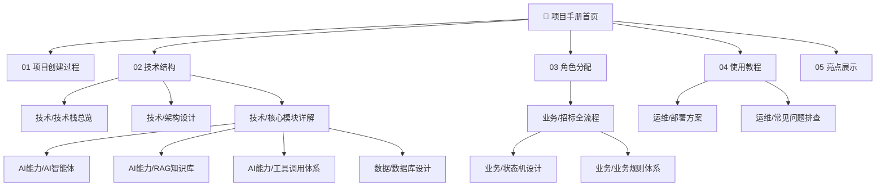

---
tags:
  - PGI
  - 首页
  - 导航
aliases:
  - 首页
  - Home
  - 项目手册
---

# 📖 PGI 招标智能 AI 管理系统 · 项目手册

> **AI Native 的招标全流程管理平台**——把传统招标业务（项目→公告→投标→评标→中标）与 AI 智能体（对话、RAG 知识库、工具调用）深度融合，让招标既规范严谨，又智能高效。

本手册由 18 篇互相关联的笔记组成，覆盖项目创建过程、技术结构、角色分配、使用教程、亮点展示五大核心主题，以及技术、业务、AI 能力、数据、运维五大支撑专题。所有笔记通过 `[[]]` 双链互相关联，形成完整的知识网络。

---

## 🗺️ 知识地图



---

## 📚 五大核心笔记

这五篇笔记是客户必看的核心内容，覆盖项目从构思到使用的全流程。

| # | 笔记 | 内容 | 适合谁看 |
|---|------|------|---------|
| 1 | [[01-项目创建过程]] | 构思背景、招标业务四大痛点、4 大里程碑、技术决策、挑战突破、迭代计划 | 决策者、项目经理 |
| 2 | [[02-技术结构]] | 技术栈总览、分层架构、9 大模块、模块依赖、关键技术决策、前端架构 | 技术负责人、架构师 |
| 3 | [[03-角色分配]] | 10 类角色（业务/AI/系统）职责、权限三层机制、角色协作模式、AI 工具权限映射 | 产品、运营、客户 |
| 4 | [[04-使用教程]] | 8 步启动、4 大核心功能使用、启动检查清单、生产部署、常见问题 | 实施人员、最终用户 |
| 5 | [[05-亮点展示]] | 五大核心卖点、对比传统系统、适用场景、商业价值量化、ROI 分析 | 销售售前、潜在买家 |

---

## 🔧 技术专题

深入技术细节，适合开发人员理解系统"用了什么技术、怎么组装、为什么这么设计"。

| 笔记 | 核心内容 |
|------|---------|
| [[技术栈总览]] | 后端 15 项 + 前端 7 项技术选型、选型理由深度解析、双端点解耦方案、版本锁定原则、依赖配置示例 |
| [[架构设计]] | 四层架构、模块拓扑、6 大跨模块调用规则、模块依赖矩阵、事件驱动解耦、多租户隔离、乐观锁、设计模式 |
| [[核心模块详解]] | 9 大模块内部结构、子包划分、核心类清单、14 张业务表 + 11 张 AI 表、Service 清单、Controller 清单 |

---

## 💼 业务专题

深入业务细节，适合业务人员和产品经理理解"招标流程怎么走、状态怎么管、规则怎么校验"。

| 笔记 | 核心内容 |
|------|---------|
| [[招标全流程]] | 项目立项→公告→投标→评标→中标→归档 6 阶段详解、每阶段操作/角色/规则、辅助模块、异常处理 |
| [[状态机设计]] | 9 个状态机总览、状态机引擎 API、10 个 Action 枚举、各状态机详细流转、自动流转定时任务、使用示例 |
| [[业务规则体系]] | 120 条规则（BR001-BR120）、规则校验机制、典型规则详解、6 种幂等方案、53 个异常类、SSOT 约束 |

---

## 🤖 AI 能力专题

深入 AI 智能体细节，适合理解"AI 怎么工作、怎么记忆、怎么保证安全"。

| 笔记 | 核心内容 |
|------|---------|
| [[AI智能体]] | 能力全景、技术架构、SSE 流式对话实现、短期+长期记忆、用量审计、操作确认回滚、会话生命周期、接口清单 |
| [[RAG知识库]] | RAG 原理、完整处理流程、文档状态机、异步任务队列、与 AI 协作机制、表结构、配置参数、优化建议 |
| [[工具调用体系]] | Function Calling 原理、12 个工具清单、工具实现示例、注册机制、调用日志、写操作确认回滚、权限校验、扩展指南 |

---

## 🗄️ 数据与运维

| 笔记 | 核心内容 |
|------|---------|
| [[数据库设计]] | 55 张表分类、核心业务表、AI 表、6 大设计模式、ER 关系、索引设计、字典数据、SQL 文件清单、数据生命周期 |
| [[部署方案]] | 本地开发环境、Docker 生产部署、构建命令、ChromaDB 启动、SQL 导入、配置文件体系、启动检查清单、部署脚本 |
| [[常见问题排查]] | 22 个高频问题、启动类/运行类/AI 功能类/性能类/部署类五大类排查方案、通用排查流程 |

---

## 🎯 快速入口

### 我想了解项目价值
→ [[05-亮点展示]] → [[01-项目创建过程]]

### 我想看技术架构
→ [[02-技术结构]] → [[架构设计]] → [[核心模块详解]]

### 我想部署使用
→ [[04-使用教程]] → [[部署方案]] → [[常见问题排查]]

### 我想理解业务流程
→ [[招标全流程]] → [[状态机设计]] → [[业务规则体系]]

### 我想看 AI 能力
→ [[AI智能体]] → [[工具调用体系]] → [[RAG知识库]]

### 我想看角色分工
→ [[03-角色分配]]

### 我想看数据库设计
→ [[数据库设计]]

---

## 📊 项目数据速览

| 维度 | 数量 |
|------|------|
| 后端 Maven 模块 | 9 个 |
| 数据库表 | 55+ 张 |
| 状态机 | 9 个 |
| 业务规则 | 120 条（BR001-BR120） |
| 异常类 | 53 个 |
| AI 工具 | 12 个 |
| 幂等方案 | 6 种 |
| 角色 | 10 类 |
| 跨模块调用规则 | 6 条 |
| AI 执行约束 | 8 条（AC-01~AC-08） |
| 开发规范 | 1936 行 |

---

## 🏷️ 标签云

#PGI  #AI_Native  #招标  #Spring_AI  #RAG  #状态机  #业务规则  #工具调用  #ChromaDB  #DeepSeek  #Vue3  #多租户  #事件驱动  #幂等  #乐观锁  #SSE  #Function_Calling  #向量检索

---

## 📁 笔记目录结构

```
PGI_项目手册/
├── README.md                  # 本文件（首页导航）
├── 01-项目创建过程.md          # 构思/里程碑/决策/挑战
├── 02-技术结构.md              # 技术栈/架构/模块关系
├── 03-角色分配.md              # 10 类角色职责/权限机制
├── 04-使用教程.md              # 8 步启动/核心功能使用
├── 05-亮点展示.md              # 五大卖点/对比/商业价值
├── 技术/
│   ├── 技术栈总览.md
│   ├── 架构设计.md
│   └── 核心模块详解.md
├── 业务/
│   ├── 招标全流程.md
│   ├── 状态机设计.md
│   └── 业务规则体系.md
├── AI能力/
│   ├── AI智能体.md
│   ├── RAG知识库.md
│   └── 工具调用体系.md
├── 数据/
│   └── 数据库设计.md
└── 运维/
    ├── 部署方案.md
    └── 常见问题排查.md
```

---

## 🔗 外部资源

| 资源 | 说明 |
|------|------|
| 开发规范 | 《魔丸组招标智能 AI 系统开发规范_AI_Native_v3.0》（SSOT，1936 行） |
| 项目分析报告 | `doc/项目全面分析报告.md` |
| 项目规划 | `doc/项目规划.md` |
| 架构文档 | `doc/架构.md` |
| 启动配置 | `doc/项目启动配置.md` |

---

## 📖 阅读建议

### 决策者/项目经理（30 分钟）
1. [[01-项目创建过程]] — 了解项目背景和决策
2. [[05-亮点展示]] — 理解项目价值
3. [[03-角色分配]] — 了解角色分工

### 技术负责人/架构师（1 小时）
1. [[02-技术结构]] — 整体技术架构
2. [[架构设计]] — 架构细节
3. [[核心模块详解]] — 模块内部结构
4. [[技术栈总览]] — 技术选型

### 开发人员（2 小时）
1. [[核心模块详解]] — 模块和类清单
2. [[状态机设计]] — 状态机引擎
3. [[业务规则体系]] — 业务规则
4. [[AI智能体]] — AI 实现
5. [[数据库设计]] — 表结构

### 实施人员/最终用户（1 小时）
1. [[04-使用教程]] — 启动和使用
2. [[部署方案]] — 部署细节
3. [[常见问题排查]] — 故障排查

### 销售售前（30 分钟）
1. [[05-亮点展示]] — 卖点和对标
2. [[01-项目创建过程]] — 背景故事
3. [[03-角色分配]] — 适用场景

---

## 🎯 项目愿景

> **让招标业务既规范严谨（状态机+规则+幂等+审计），又智能高效（AI 对话+RAG+工具调用），并且让企业敢用 AI（写操作确认+快照回滚）。**

---

*最后更新：2026-07-20 · PGI 项目手册 · 18 篇笔记 · 142+ 双链*
