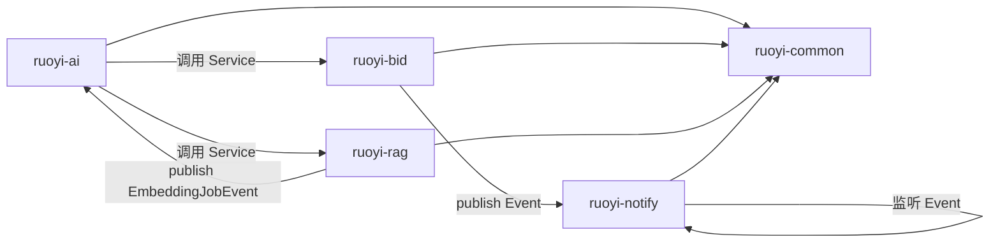

---
tags:
  - PGI
  - 技术
  - 架构
aliases:
  - 系统架构
  - Architecture
  - 架构设计
---

# 架构设计

本文档详细阐述 PGI 系统的整体架构、分层设计、模块拓扑、跨模块调用规则、关键架构决策和设计模式。适合架构师和开发人员理解系统"怎么组装、为什么这么设计"。

## 一、整体架构分层

系统采用经典的四层架构，每层职责清晰、不可越界：

```
┌─────────────────────────────────────────────────────────┐
│                    前端表现层                             │
│   Vue 3 + Element Plus / Pinia / SSE 流式对话            │
│   AI 对话组件 / 权限指令 / 业务页面                       │
└────────────────────────┬────────────────────────────────┘
                         │ HTTP / SSE (JWT 鉴权)
┌────────────────────────▼────────────────────────────────┐
│                  接口接入层 (ruoyi-admin)                 │
│   Controller 接收请求 / 参数校验 / 调用 Service           │
│   禁止直接操作数据库 / 禁止跨模块调用其他 Controller      │
└────────────────────────┬────────────────────────────────┘
                         │
   ┌─────────────────────┼─────────────────────┐
   ▼                     ▼                     ▼
┌──────────┐       ┌──────────────┐      ┌──────────────┐
│  业务层   │       │    AI 层      │      │   基础层      │
│          │◄──────│              │      │              │
│ ruoyi-bid│       │ ruoyi-ai     │      │ ruoyi-common │
│ ruoyi-   │       │ ruoyi-rag    │      │ ruoyi-system │
│  notify  │       │              │      │ ruoyi-       │
│          │       │              │      │  framework   │
│          │       │              │      │ ruoyi-quartz │
└────┬─────┘       └──────┬───────┘      └──────────────┘
     │                    │
     │  跨模块仅通过       │ AI 可调用所有
     │  Service 接口       │ 业务 Service
     │                    │
     └────────┬───────────┘
              ▼
   ┌─────────────────────┐
   │      存储层           │
   │  MySQL (业务+AI元数据)│
   │  Redis (缓存+短期记忆)│
   │  ChromaDB (向量数据)  │
   └─────────────────────┘
```

### 层级职责与边界

| 层 | 职责 | 不可越界 |
|----|------|---------|
| **Controller** | 接收请求、参数校验（`@Valid`）、调用 Service、组装响应 | 禁止直接操作数据库；禁止跨模块调用其他 Controller |
| **Service** | 业务逻辑、状态机校验、规则校验、事务管理 | 禁止跨模块调 Mapper；循环依赖用事件解耦 |
| **Mapper** | 数据持久化（MyBatis XML） | 禁止含业务逻辑；查询加 `del_flag='0'`；更新加 `version` 乐观锁 |
| **Entity** | 数据载体（DTO/VO/Domain） | 禁止含行为逻辑；审计字段继承 BaseEntity |

## 二、模块拓扑与依赖

### 2.1 模块拓扑图

```
ruoyi-admin (启动装配入口, 端口 8080)
  ├── ruoyi-framework  → ruoyi-system → ruoyi-common (基础层)
  ├── ruoyi-quartz     → ruoyi-common (定时任务)
  ├── ruoyi-bid        → ruoyi-common (招标业务, 含状态机+规则引擎)
  ├── ruoyi-ai         → ruoyi-common + ruoyi-system + spring-ai-openai (AI智能体)
  ├── ruoyi-rag        → ruoyi-ai + spring-ai-chroma + tika (RAG知识库)
  └── ruoyi-notify     → ruoyi-common + spring-mail (消息通知)
```

### 2.2 Maven 依赖关系

| 模块 | 依赖 |
|------|------|
| ruoyi-bid | ruoyi-common |
| ruoyi-ai | ruoyi-common, ruoyi-system, spring-ai-starter-model-openai |
| ruoyi-rag | ruoyi-ai, spring-ai-starter-vector-store-chroma, tika-core, tika-parsers-standard-package |
| ruoyi-notify | ruoyi-common, spring-boot-starter-mail |
| ruoyi-admin | 所有业务模块 + springdoc |

### 2.3 依赖方向规则

- **common 是最底层**：所有模块都依赖它，它不依赖任何业务模块
- **AI 可调用所有业务**：ruoyi-ai 可调用 bid 等业务模块的 Service
- **反向禁止**：业务模块不能调用 AI 模块
- **rag 只被 ai 调用**：ruoyi-rag 不对外暴露 Controller，由 ai 模块统一调用
- **notify 只接收事件**：不主动调用业务模块

## 三、跨模块调用规则

这是架构设计的核心约束，违反即架构违规（AC-06）：

### 3.1 六大跨模块规则

| 规则编号 | 规则 | 实现方式 |
|---------|------|---------|
| MB-R01 | 跨模块调用必须通过 Service 接口，禁止 Mapper 跨模块互调 | Spring 依赖注入 `@Autowired` 其他模块的 `IXxxService` |
| MB-R02 | Controller 禁止直接操作数据库，禁止跨模块调用其他 Controller | Controller 仅调用本模块 Service |
| MB-R03 | 循环依赖禁止：A 调 B 则 B 不可调 A | 通过事件机制（ApplicationEvent）解耦 |
| MB-R04 | AI 模块（M13）调用业务模块必须通过 Service 接口 + 权限校验 | 工具实现中注入业务 Service，执行前校验当前用户权限 |
| MB-R05 | 知识库模块（M14）与 AI 模块（M13）双向依赖通过事件解耦 | M14 发 `EmbeddingJobEvent`，M13 监听执行向量化 |
| MB-R06 | 通知模块（M15）仅接收事件，不主动调用业务模块 | 业务模块 publish `NotifyEvent`，M15 监听发送 |

### 3.2 模块依赖矩阵（规范 1.2 节）

| 调用方模块 | 允许调用的被调方模块 | 禁止直接操作的表 |
|-----------|-------------------|----------------|
| M02 project | M09, M10, M12, M15 | M03~M08 |
| M03 notice | M02, M09, M10, M15 | M04~M08 |
| M04 document | M02, M09, M10 | M03, M05~M08 |
| M05 bid | M02, M04, M08, M09, M11, M15 | M03, M06, M07 |
| M06 evaluation | M02, M05, M09, M15 | M03, M04, M07, M08 |
| M07 award | M02, M05, M06, M09, M10, M15 | M03, M04, M08 |
| M13 ai | M02~M12 所有, M14 | 禁止直接操作任何业务表 |
| M14 knowledge | M09, M13 | 所有业务表 |
| M15 notify | M01 | 所有业务表 |

## 四、关键架构决策

### 4.1 事件驱动解耦循环依赖

招标业务存在两处天然的双向依赖，若不解耦会形成循环依赖导致 Spring 启动失败。

| 双向依赖场景 | 解耦机制 |
|-------------|---------|
| 知识库（M14）↔ AI（M13）| M14 发 `EmbeddingJobEvent`，M13 监听执行向量化 |
| 业务模块 → 通知（M15）| 业务 publish `NotifyEvent`，M15 监听异步发送 |

#### 实现示例

```java
// 业务模块发布事件
@Service
public class ProjectServiceImpl implements IProjectService {
    @Autowired
    private ApplicationEventPublisher eventPublisher;

    public void submit(Long projectId) {
        // ... 业务逻辑 ...
        eventPublisher.publishEvent(new NotifyEvent(
            "项目已提交", "项目 " + projectId + " 已提交注册", userIds));
    }
}

// 通知模块监听事件
@Component
public class NotifyEventListener {
    @EventListener
    @Async
    public void handleNotifyEvent(NotifyEvent event) {
        notifyService.sendInApp(event);
        notifyService.sendEmail(event);
    }
}
```

### 4.2 多租户数据隔离

| 维度 | 方案 |
|------|------|
| 隔离字段 | `dept_id` 全局隔离 |
| AOP 自动过滤 | `@DataScope(deptAlias="d")` 注解 + DataScopeAspect |
| 数据权限范围 | 全部 / 本部门 / 本部门及以下 / 仅本人 |

```java
@DataScope(deptAlias = "d")
public List<Project> selectProjectList(ProjectQueryDTO query) {
    return projectMapper.selectProjectList(query);
}
```

AOP 自动在 SQL 中注入：
```sql
SELECT * FROM pgi_project d
WHERE d.del_flag = '0'
  AND d.dept_id IN (
      SELECT dept_id FROM sys_dept
      WHERE dept_id = #{当前用户dept_id}
         OR FIND_IN_SET(#{当前用户dept_id}, ancestors)
  )
```

### 4.3 乐观锁防并发

```sql
-- 更新必带 version 校验
UPDATE pgi_project
SET status = #{status}, version = version + 1
WHERE id = #{id} AND version = #{version}
```

更新返回影响行数，若为 0 则说明版本不匹配（被其他人修改过），抛 `OptimisticLockException`。

### 4.4 SSE 流式输出

| 端 | 实现 |
|----|------|
| 前端 | `fetch + ReadableStream + AbortController`，按 `data:` 字段分行解析 |
| 后端 | `SseEmitter` / `Flux<ServerSentEvent>` |
| 心跳 | 15 秒发送一次，防止代理超时断开 |
| 超时 | 3600 秒无活动自动关闭 |
| 单用户单连接 | 同一用户同时只有一个 SSE 连接 |

### 4.5 逻辑删除

```sql
-- 查询必带
WHERE del_flag = '0'
-- 删除执行（不是物理删除）
UPDATE pgi_xxx SET del_flag = '2' WHERE id = #{id}
```

### 4.6 审计字段

所有实体继承 `BaseEntity`，含：
- `create_by` / `create_time`：创建人/时间
- `update_by` / `update_time`：更新人/时间
- `remark`：备注

由于使用原生 MyBatis（无 MetaObjectHandler），审计字段在 Service 层手动 set：

```java
public void createProject(ProjectCreateDTO dto) {
    Project project = new Project();
    // ... 业务字段 ...
    project.setCreateBy(SecurityUtils.getUsername());
    project.setCreateTime(new Date());
    projectMapper.insert(project);
}
```

## 五、设计模式应用

| 设计模式 | 应用场景 | 实现类 |
|---------|---------|--------|
| 模板方法 | 资讯爬虫（已移除） | BaseCrawler |
| 策略模式 | 数据权限范围 | DataScopeAspect |
| 观察者模式 | 事件驱动 | ApplicationEvent |
| 责任链模式 | Spring AI Advisor 链 | UsageAdvisor / ToolConfirmAdvisor |
| 工厂模式 | 状态机引擎注册 | StateMachineEngine.register() |
| AOP 代理 | 操作日志/数据权限/幂等 | LogAspect / DataScopeAspect / IdempotentAspect |

## 六、模块协作关系图



## 七、配置文件体系

### 7.1 后端配置

| 配置文件 | 内容 | Profile |
|----------|------|---------|
| `application.yml` | 主配置（端口 8080, Redis, MyBatis, Token, XSS） | 默认 |
| `application-druid.yml` | 数据源配置（MySQL pgi 库） | druid |
| `application-ai.yml` | AI 模块配置（DeepSeek + ChromaDB + 智谱 embedding + 业务参数） | ai |

`application.yml` 中：
```yaml
spring:
  profiles:
    active: druid       # 激活数据源
    include: ai         # 包含 AI 模块
```

### 7.2 前端配置

| 配置文件 | 内容 |
|----------|------|
| `.env.development` | `VITE_APP_BASE_API=/dev-api` |
| `.env.production` | `VITE_APP_BASE_API=/prod-api` + gzip |
| `vite.config.js` | 端口 80，代理 `/dev-api` → `http://localhost:8080` |

## 八、技术风险与应对

| 风险点 | 说明 | 应对措施 |
|--------|------|---------|
| Spring AI 2.0 API 变动 | 较新版本，API 可能与文档示例有差异 | 以官方文档为准，先写最小 demo 验证 |
| Embedding 双端点 | chat 与 embedding 端点不同 | 自定义 EmbeddingConfig，@Primary 覆盖 |
| ChromaDB 版本兼容 | spring-ai-chroma 对版本有要求 | 用 latest，启动时 initialize-schema 验证 |
| Spring Boot 4.0 稳定性 | 主版本升级可能有 breaking change | 依赖 RuoYi 已验证的兼容性 |
| SSE 连接管理 | 高并发下资源泄漏 | 单用户单连接 + 心跳 + 超时关闭 |
| 原生 MyBatis 实现 | 无自动填充/乐观锁/逻辑删除注解 | XML 手动实现，审计字段 Service 层 set |
| 集群定时任务重复 | 多实例同时执行 | Redisson 分布式锁 |

## 相关笔记
- [[技术栈总览]] — 架构用了哪些技术
- [[核心模块详解]] — 每个模块内部结构
- [[数据库设计]] — 存储层表设计
- [[02-技术结构]] — 架构在整体技术结构中的位置
- [[01-项目创建过程]] — 架构决策的过程
- [[部署方案]] — 架构如何部署
