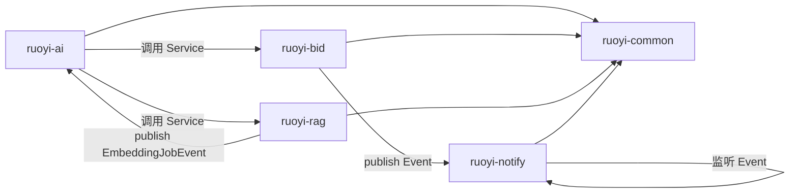

---
tags:
  - PGI
  - 技术
  - 模块
aliases:
  - 模块清单
  - Modules
  - 核心模块
---

# 核心模块详解

本文档详细列出 PGI 系统的 9 大后端模块，每个模块的内部结构、子包划分、核心类清单、表清单、Service 清单。适合开发人员快速定位"某个功能在哪个模块的哪个类"。

## 一、模块全景图

| # | 模块 | 性质 | 职责 | 状态 |
|---|------|------|------|------|
| 1 | `ruoyi-admin` | 启动入口 | Spring Boot 装配入口，20+ 系统级 Controller | ✅ 完整 |
| 2 | `ruoyi-common` | 基础层 | 工具/注解/异常/常量/状态机引擎 | ✅ 完整 |
| 3 | `ruoyi-system` | 系统管理 | 用户/角色/菜单/字典（复用若依标准） | ✅ 完整 |
| 4 | `ruoyi-framework` | 框架核心 | Security/JWT/AOP/动态数据源/全局异常 | ✅ 完整 |
| 5 | `ruoyi-quartz` | 定时任务 | Quartz 任务调度 | ✅ 完整 |
| 6 | `ruoyi-bid` | 招标业务 | 招标全生命周期（14 张表） | 🚧 脚手架 |
| 7 | `ruoyi-ai` | AI 智能体 | 对话/工具调用/记忆/用量审计 | 🚧 脚手架 |
| 8 | `ruoyi-rag` | RAG 知识库 | 文档解析/分块/向量化/检索 | 🚧 脚手架 |
| 9 | `ruoyi-notify` | 消息通知 | 站内信/邮件/事件驱动 | 🚧 脚手架 |

---

## 二、基础层（已完成）

### 2.1 ruoyi-admin（启动入口）

**路径**: `ruoyi-admin/`

启动类 `RuoYiApplication.java`，排除默认数据源（使用 Druid 动态数据源），激活 `druid` + `ai` 两个 profile。

#### Controller 清单（20+ 个）

| 分类 | Controller | API 路径 |
|------|-----------|----------|
| 公共 | CaptchaController | /captchaImage |
| 公共 | CommonController | /common (文件上传下载) |
| 登录 | SysLoginController | /login, /getInfo, /getRouters |
| 系统 | SysUserController | /system/user |
| 系统 | SysRoleController | /system/role |
| 系统 | SysMenuController | /system/menu |
| 系统 | SysDeptController | /system/dept |
| 系统 | SysPostController | /system/post |
| 系统 | SysDictTypeController | /system/dict/type |
| 系统 | SysDictDataController | /system/dict/data |
| 系统 | SysConfigController | /system/config |
| 系统 | SysNoticeController | /system/notice |
| 系统 | SysProfileController | /system/user/profile |
| 监控 | CacheController | /monitor/cache |
| 监控 | ServerController | /monitor/server |
| 监控 | SysUserOnlineController | /monitor/online |
| 监控 | SysOperlogController | /monitor/operlog |
| 监控 | SysLogininforController | /monitor/logininfor |
| 监控 | SysJobController | /monitor/job |
| 工具 | TestController | /test/* |

#### 配置文件

- `application.yml` — 主配置（端口 8080, Redis, MyBatis, Token, XSS 等）
- `application-druid.yml` — 数据源配置（MySQL pgi 库）
- `application-ai.yml` — AI 模块配置（DeepSeek + ChromaDB + 业务参数）

### 2.2 ruoyi-common（基础层）

**路径**: `ruoyi-common/src/main/java/com/ruoyi/common/`

无 Controller，是全项目基础层。

#### 核心域

| 类 | 用途 |
|----|------|
| `AjaxResult` | 统一响应封装：code/msg/data |
| `BaseEntity` | 实体基类：create_by/time + update_by/time + remark |
| `R` | 通用响应 |
| `PageDomain` | 分页参数 |
| `TableDataInfo` | 分页响应：rows/total |

#### 注解

| 注解 | 用途 |
|------|------|
| `@DataScope` | 数据权限（dept_id 过滤） |
| `@DataSource` | 动态数据源切换 |
| `@Log` | 操作日志 |
| `@RateLimiter` | 限流 |
| `@RepeatSubmit` | 防重复提交 |
| `@Excel` | Excel 导入导出 |
| `@Sensitive` | 数据脱敏 |
| `@Anonymous` | 匿名访问 |
| `@Idempotent` | 幂等（expireSeconds 默认 600s） |

#### 常量与枚举

- **常量**: `Constants`, `CacheConstants`, `UserConstants`, `HttpStatus`
- **枚举**: `BusinessType`, `BusinessStatus`, `DataSourceType`, `HttpMethod`, `LimitType`
- **PGI 枚举**（11 个）: `ProjectStatus`, `BidStatus`, `NoticeStatus`, `DocumentStatus`, `EvaluationStatus`, `AwardStatus`, `QualificationStatus`, `DepositStatus`, `VenueStatus`, `ConversationStatus`, `KnowledgeDocStatus`, `AuditStatus`

#### 异常体系（PgiException 体系）

`ServiceException` 是 `final class`（Integer code），无法继承。新建 `PgiException` 体系：

| 类别 | 基类 | 数量 | 典型异常 |
|------|------|------|---------|
| 业务异常 | `BizException` | 20 | `ProjectNotFoundException` / `BidStatusException` |
| AI 异常 | `AiException` | 11 | `AiModelTimeoutException` / `AiEmbeddingException` |
| 权限异常 | `AuthException` | 5 | `ForbiddenException` / `DeptScopeException` |
| 系统异常 | `SysException` | 6 | `OptimisticLockException` / `ConfigException` |
| 外部异常 | `ExternalException` | 5 | `EmailSendException` / `ThirdPartyApiException` |
| **合计** | — | **53** | — |

#### 状态机引擎

```
ruoyi-common/src/main/java/com/ruoyi/common/statemachine/
├── StateMachineEngine.java                  # 泛型状态机引擎
├── StateTransition.java                     # 状态跳转定义：from→to+action
├── TransitionValidator.java                 # 跳转前置校验接口
└── IllegalStateTransitionException.java     # 非法状态跳转异常
```

引擎设计：`StateMachineEngine<S extends Enum, A extends Enum>`，通过 `register(from, action, to, validator)` 注册跳转规则，`transition(current, action, context)` 执行校验+跳转。

#### 工具类

`SecurityUtils`, `StringUtils`, `DateUtils`, `ServletUtils`, `DictUtils`, `ExcelUtil`, `FileUtils`, `HttpUtils`, `IpUtils`, `IdUtils`, `Md5Utils`

#### 过滤器

`XssFilter`, `RefererFilter`

### 2.3 ruoyi-framework（框架核心）

**路径**: `ruoyi-framework/src/main/java/com/ruoyi/framework/`

#### 配置类

| 类 | 用途 |
|----|------|
| `SecurityConfig` | Spring Security 无状态 + JWT |
| `RedisConfig` | Redis 序列化/连接池 |
| `MyBatisConfig` | MyBatis 配置 |
| `DruidConfig` | 动态数据源 |
| `ThreadPoolConfig` | 线程池 |
| `CaptchaConfig` | 验证码 |
| `ApplicationConfig` | 应用配置 |
| `I18nConfig` | 国际化 |
| `FilterConfig` | 过滤器注册 |
| `ServerConfig` | 服务信息 |

#### AOP 切面

| 切面 | 用途 |
|------|------|
| `DataScopeAspect` | 数据权限 dept_id 过滤 |
| `DataSourceAspect` | 数据源切换 |
| `LogAspect` | 操作日志 |
| `RateLimiterAspect` | 限流 |
| `IdempotentAspect` | 幂等（X-Request-Id + Redis SETNX） |

#### 安全

| 类 | 用途 |
|----|------|
| `JwtAuthenticationTokenFilter` | JWT 过滤器 |
| `AuthenticationEntryPointImpl` | 认证入口 |
| `LogoutSuccessHandlerImpl` | 登出处理 |
| `TokenService` | JWT 生成/解析 |
| `UserDetailsServiceImpl` | 用户详情 |
| `PermissionService` | @ss 权限校验 |

#### Web 服务

`SysLoginService`, `SysPasswordService`, `SysPermissionService`, `SysRegisterService`

#### 全局异常

`GlobalExceptionHandler`（统一捕获 PgiException）

### 2.4 ruoyi-system（系统管理）

**路径**: `ruoyi-system/src/main/java/com/ruoyi/system/`

复用若依标准系统模块，包含 12 个 Domain、15 个 Mapper、13 个 Service。

**实体**: SysConfig, SysNotice, SysOperLog, SysPost, SysLogininfor, SysRoleDept, SysRoleMenu, SysUserOnline, SysUserPost, SysUserRole 等

**Mapper XML**: 18 个，位于 `resources/mapper/system/`

### 2.5 ruoyi-quartz（定时任务）

**路径**: `ruoyi-quartz/src/main/java/com/ruoyi/quartz/`

- **Controller**: `SysJobController`(/monitor/job), `SysJobLogController`(/monitor/jobLog)
- **Domain**: SysJob, SysJobLog
- **配置**: `ScheduleConfig`(Quartz 调度器)
- **工具**: `AbstractQuartzJob`, `QuartzJobExecution`, `ScheduleUtils`, `JobInvokeUtil`, `CronUtils`

---

## 三、业务层（脚手架，按规划实现）

### 3.1 ruoyi-bid（招标业务，M02-M12）

**路径**: `ruoyi-bid/src/main/java/com/ruoyi/bid/`

> 规范定义 15 个模块（M01~M15），本模块聚合了 M02~M12 共 11 个子领域，Service 层保持独立。

#### 包结构

```
ruoyi-bid/src/main/java/com/ruoyi/bid/
├── controller/    # 11个Controller
├── entity/        # 14个实体
├── mapper/        # 14个Mapper接口
├── service/       # 11个IService + impl
├── dto/           # CreateDTO/UpdateDTO/QueryDTO
├── vo/            # VO
├── state/         # 状态机实现
└── rule/          # 业务规则校验器
```

#### 实体清单（14 个）

| 实体 | 表名 | 状态枚举 |
|------|------|---------|
| Project | pgi_project | ProjectStatus |
| TenderNotice | pgi_tender_notice | NoticeStatus |
| TenderDocument | pgi_tender_document | DocumentStatus |
| Bid | pgi_bid | BidStatus |
| Bidder | pgi_bidder | — |
| Evaluation | pgi_evaluation | EvaluationStatus |
| EvaluationExpert | pgi_evaluation_expert | — |
| Award | pgi_award | AwardStatus |
| Qualification | pgi_qualification | QualificationStatus |
| Deposit | pgi_deposit | DepositStatus |
| DepositFlow | pgi_deposit_flow | — |
| VenueReservation | pgi_venue_reservation | VenueStatus |
| Attachment | pgi_attachment | — |
| AuditLog | pgi_audit_log | AuditStatus |

#### Service 接口清单

##### 招标管理

| Service | 方法 | 业务规则 | 状态机 |
|---------|------|---------|--------|
| IProjectService | save/update/delete/list/getById | BR001-BR015 | submit:DRAFT→REGISTERED; terminate:*→TERMINATED; openBid:BIDDING→EVALUATING |
| ITenderNoticeService | save/update/delete/list/getById/submit/audit/withdraw | BR016-BR028 | submit:DRAFT→UNDER_REVIEW; audit:UNDER_REVIEW→PUBLISHED/DRAFT; withdraw:PUBLISHED→WITHDRAWN |
| ITenderDocumentService | save/update/delete/list/getById/submit/audit/publish | — | submit:DRAFT→SUBMITTED; audit:SUBMITTED→APPROVED/REJECTED; publish:APPROVED→PUBLISHED |

##### 交易管理

| Service | 方法 | 业务规则 | 状态机 |
|---------|------|---------|--------|
| IBidService | save/update/delete/list/getById/submit/withdraw | BR029-BR045 | submit:DRAFT→SUBMITTED; withdraw:DRAFT→WITHDRAWN |
| IEvaluationService | save/update/delete/list/getById/start/score/complete/abort | BR046-BR058 | start:PENDING→IN_PROGRESS; complete:IN_PROGRESS→COMPLETED; abort:IN_PROGRESS→ABORTED |
| IAwardService | save/update/delete/list/getById/publish/confirm/cancel | BR059-BR070 | publish:DRAFT→PUBLISHED; confirm:PUBLISHED→CONFIRMED; cancel:PUBLISHED→CANCELED |
| IQualificationService | save/update/delete/list/getById/submit/audit/renew | BR071-BR080 | submit:DRAFT→SUBMITTED; audit:SUBMITTED→APPROVED/REJECTED; renew:EXPIRED→SUBMITTED |
| IDepositService | save/update/list/getById/pay/refund/forfeit | BR097-BR104 | pay:PENDING→PAID; refund:PAID→REFUNDED; forfeit:PAID→FORFEITED |
| IVenueService | save/update/delete/list/getById/cancel | BR105-BR110 | cancel:PENDING/CONFIRMED→CANCELED |
| IAttachmentService | upload/download/remove/list | BR081-BR088 | MD5去重(IDM-02) |

##### 审核管理

| Service | 方法 | 业务规则 |
|---------|------|---------|
| IAuditService | list/getById/audit/export | BR089-BR096 |

#### Controller 清单

```
ruoyi-bid/src/main/java/com/ruoyi/bid/controller/
├── ProjectController.java        # /api/project/** — CRUD+submit+terminate+openBid
├── NoticeController.java         # /api/notice/** — CRUD+submit+audit+withdraw
├── DocumentController.java       # /api/document/** — CRUD+submit+audit+publish
├── BidController.java            # /api/bid/** — CRUD+submit+withdraw
├── EvaluationController.java     # /api/evaluation/** — CRUD+start+score+complete+abort
├── AwardController.java          # /api/award/** — CRUD+publish+confirm+cancel
├── QualificationController.java  # /api/qualification/** — CRUD+submit+audit
├── DepositController.java        # /api/deposit/** — CRUD+refund+forfeit
├── VenueController.java          # /api/venue/** — CRUD+cancel
├── AttachmentController.java     # /api/attachment/** — upload+download+remove
└── AuditController.java          # /api/audit/** — query+audit+export
```

#### 跨模块调用

- `ProjectService` → `VenueService`（BR008）、`TenderNoticeService`（BR009）
- `BidService` → `ProjectService`（BR033）、`DepositService`（BR035）、`AttachmentService`（BR036）、`QualificationService`（BR041）
- `EvaluationService` → `ProjectService`、`BidService`
- `AwardService` → `ProjectService`、`BidService`、`EvaluationService`

#### Mapper XML 位置

```
ruoyi-bid/src/main/resources/mapper/
├── ProjectMapper.xml / TenderNoticeMapper.xml / TenderDocumentMapper.xml
├── BidMapper.xml / BidderMapper.xml
├── EvaluationMapper.xml / EvaluationExpertMapper.xml
├── AwardMapper.xml / QualificationMapper.xml
├── DepositMapper.xml / DepositFlowMapper.xml
├── VenueReservationMapper.xml / AttachmentMapper.xml
└── AuditLogMapper.xml
```

**XML 编码规范**：查询加 `del_flag = '0'`；数据权限通过 @DataScope 注入 `dept_id`；更新加 `AND version = #{version}`；删除执行 `UPDATE SET del_flag = '2'`。

### 3.2 ruoyi-ai（AI 智能体，M13）

**路径**: `ruoyi-ai/src/main/java/com/ruoyi/ai/`

依赖 `spring-ai-starter-model-openai`，11 张表。

#### 包结构

```
ruoyi-ai/src/main/java/com/ruoyi/ai/
├── controller/    # 9个Controller
├── entity/        # 11个实体
├── mapper/        # 11个Mapper接口 + XML
├── service/       # 8个IService + impl
├── dto/           # ConversationCreateDTO / ChatMessageDTO 等
├── vo/            # ConversationVO / MessageVO 等
├── config/        # ChatClientConfig + ToolRegistry
├── agent/         # AgentOrchestrator + AgentContext
├── tool/          # 工具实现（@Tool注解）
│   ├── bid/       # 招标类工具（只读）
│   ├── system/    # 系统类工具（只读）
│   └── rag/       # RAG检索工具（只读）
├── memory/        # ChatMemoryService + LongTermMemoryService
├── sse/           # SseEmitterManager
└── advisor/       # UsageAdvisor + ToolCallLogAspect
```

#### Controller 清单

```
ruoyi-ai/src/main/java/com/ruoyi/ai/controller/
├── AIConversationController.java # /api/ai/conversation/** — 创建+list+close
├── AIChatController.java         # /api/ai/chat/{id} — SSE流式聊天
├── AIMessageController.java      # /api/ai/message/** — 历史消息
├── AIAgentController.java        # /api/ai/agent/** — 智能体CRUD
├── AIToolController.java         # /api/ai/tool/** — 工具CRUD
├── AIActionController.java       # /api/ai/action/** — 确认+rollback
├── AIMemoryController.java       # /api/ai/memory/** — 记忆CRUD
├── AIUsageController.java        # /api/ai/usage/** — 用量查询+export
└── AIKnowledgeController.java    # /api/ai/knowledge/** — 知识库管理+文档上传（委托 ruoyi-rag）
```

#### 实体清单（11 个）

AIConversation, AIMessage, AIMessageAttachment, AIAgent, AIAgentTool, AITool, AIToolCallLog, AIMemory, AIUsageLog, AIFeedback, AIActionRecord

#### 核心技术方案

- **ChatClient 配置**：通过 `OpenAiChatModel` 创建 `ChatClient` Bean
- **SSE 流式对话**：`ChatClient.prompt().messages(msgs).tools(callbacks).stream().content()` 返回 `Flux<String>`，通过 `SseEmitter` 转换为 SSE 推送
- **工具调用**：Spring AI 2.0 `@Tool` 注解自动注册 `ToolCallback`，通过 `ChatClient.tools()` 绑定
- **记忆管理**：短期(Redis 20 轮) + 长期(MySQL importance 衰减)
- **用量审计**：`UsageAdvisor` 实现 `BaseAdvisor`，拦截 ChatClient 调用记录 Token 用量
- **工具调用日志**：`ToolCallLogAspect` 通过 `@Around("@annotation(@Tool)")` 自动记录

详见 [[AI智能体]]、[[工具调用体系]]。

### 3.3 ruoyi-rag（RAG 知识库，M14）

**路径**: `ruoyi-rag/src/main/java/com/ruoyi/rag/`

依赖 `spring-ai-starter-vector-store-chroma` + `tika-parsers`，4 张表。

> ruoyi-rag **不对外暴露 Controller**。知识库管理对外接口统一由 `ruoyi-ai` 的 `AIKnowledgeController` 提供（`/api/ai/knowledge/**`），本模块仅提供内部 Service 供 `ruoyi-ai` 调用。

#### 包结构

```
ruoyi-rag/src/main/java/com/ruoyi/rag/
├── entity/        # 4个实体
├── mapper/        # 4个Mapper接口 + XML
├── service/       # 4个IService + impl
├── dto/           # KnowledgeBaseDTO / DocUploadDTO 等
├── vo/            # KnowledgeBaseVO / KnowledgeDocVO 等
├── chunker/       # DocumentParser + DocumentChunker
├── embedding/     # EmbeddingConfig + EmbeddingService
├── retrieval/     # RagRetriever
└── scheduler/     # EmbeddingJobScheduler
```

#### 实体清单（4 个）

| 实体 | 表名 |
|------|------|
| KnowledgeBase | pgi_ai_knowledge_base |
| KnowledgeDoc | pgi_ai_knowledge_doc |
| KnowledgeChunk | pgi_ai_knowledge_chunk |
| EmbeddingJob | pgi_ai_embedding_job |

详见 [[RAG知识库]]。

### 3.4 ruoyi-notify（消息通知，M15）

**路径**: `ruoyi-notify/src/main/java/com/ruoyi/notify/`

依赖 `spring-boot-starter-mail`。

#### 包结构

```
ruoyi-notify/src/main/java/com/ruoyi/notify/
├── controller/
│   └── NotifyController.java              # /api/notify/** — list+send+read+remove
├── service/
│   ├── INotifyService.java               # 通知接口：站内信/邮件
│   ├── impl/NotifyServiceImpl.java
│   ├── EmailService.java                 # 邮件服务：JavaMailSender异步发送
│   └── InAppNotifyService.java           # 站内信：复用 sys_notice 表
└── event/
    ├── NotifyEvent.java                  # 通知事件：发布-订阅解耦
    └── NotifyEventListener.java          # 事件监听：异步发送通知
```

#### 核心技术方案

- **站内消息**：复用 `ruoyi-system` 的 `SysNotice` 表和 Service，不新建表
- **邮件通知**：通过 `JavaMailSender` 异步发送（`@Async`），失败重试 3 次降级为站内信
- **事件驱动**：业务模块通过 `applicationEventPublisher.publishEvent(new NotifyEvent(...))` 发送通知请求，`NotifyEventListener` 通过 `@EventListener` + `@Async` 异步处理

---

## 四、模块协作关系



## 五、模块清单与前端菜单映射

| 前端菜单分组 | 后端 Maven 模块 | 包名 | 子领域 |
|-------------|---------------|------|--------|
| 招标管理 | ruoyi-bid | `com.ruoyi.bid` | project / notice / document |
| 交易管理 | ruoyi-bid | `com.ruoyi.bid` | bid / evaluation / award / qualification / deposit / venue / attachment |
| 审核管理 | ruoyi-bid | `com.ruoyi.bid` | audit_log |
| AI 智能体 | ruoyi-ai | `com.ruoyi.ai` | conversation / message / agent / tool / action / memory / usage |
| 知识库 | ruoyi-rag | `com.ruoyi.rag` | knowledge_base / knowledge_doc / knowledge_chunk / embedding_job |
| 消息通知 | ruoyi-notify | `com.ruoyi.notify` | 站内信 / 邮件 |

## 相关笔记
- [[架构设计]] — 模块如何组装
- [[状态机设计]] — 每个模块的状态流转
- [[业务规则体系]] — 每个模块的规则校验
- [[数据库设计]] — 每个模块的表
- [[AI智能体]] — AI 模块详解
- [[RAG知识库]] — RAG 模块详解
- [[工具调用体系]] — AI 工具详解
- [[02-技术结构]] — 模块在整体架构中的位置
