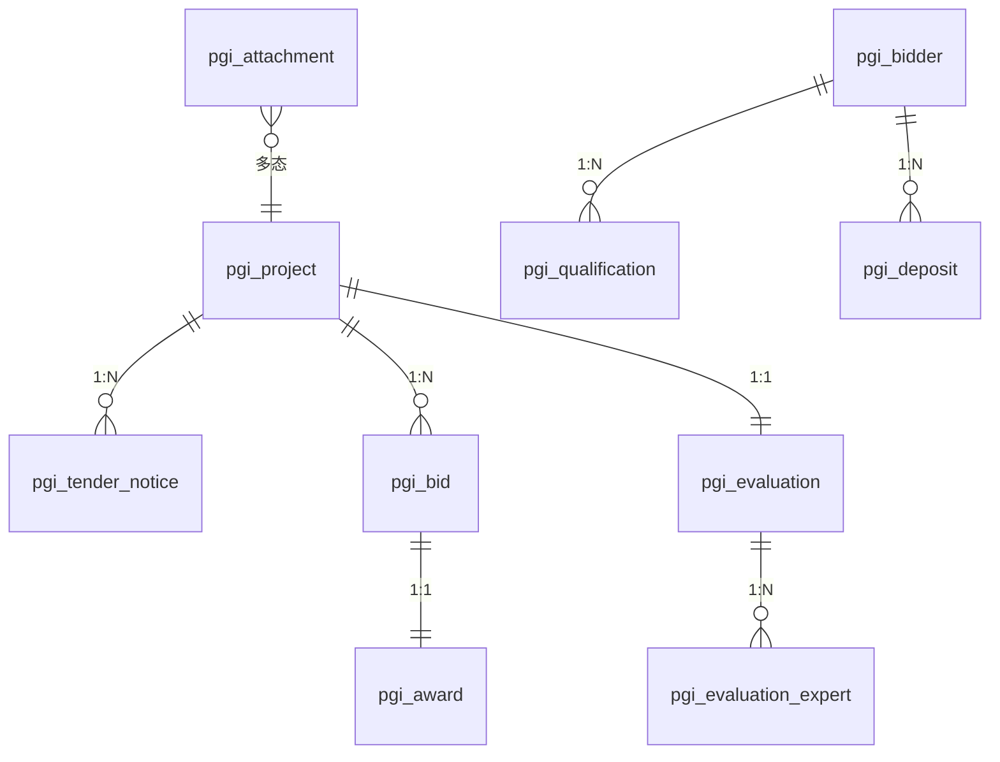

---
tags:
  - PGI
  - 数据
  - 数据库
aliases:
  - Database
  - 表结构
  - 数据库设计
---

# 数据库设计

本文档完整列出 PGI 系统的 55 张表、分类、关键字段、设计模式、ER 关系和 SQL 文件清单。适合开发人员理解"有哪些表、表怎么设计、表之间什么关系"。

## 一、表分类总览

| 分类 | 表数量 | 前缀 | 说明 | 状态 |
|------|--------|------|------|------|
| RuoYi 系统表 | 11 | `sys_` | 用户/角色/部门/菜单/字典/日志 | ✅ 已导入 |
| Quartz 表 | 11 | `QRTZ_` | 定时任务 | ✅ 已导入 |
| 业务表 | 29 | `pgi_` | 项目/公告/投标/评标/中标/资质/附件/审核/保证金/场地 | 🚧 DDL 在规范定义 |
| AI 智能体表 | 15 | `pgi_ai_` | 会话/消息/智能体/工具/知识库/记忆/用量/反馈/操作记录 | 🚧 DDL 在规范定义 |
| **合计** | **55+** | — | — | — |

## 二、RuoYi 系统表（sys_*）

复用若依标准系统表，不修改：

| 表 | 用途 |
|----|------|
| sys_user | 用户 |
| sys_role | 角色 |
| sys_dept | 部门（多租户隔离） |
| sys_menu | 菜单 |
| sys_post | 岗位 |
| sys_user_role | 用户-角色关联 |
| sys_role_menu | 角色-菜单关联 |
| sys_role_dept | 角色-部门关联（数据权限） |
| sys_user_post | 用户-岗位关联 |
| sys_dict_type | 字典类型 |
| sys_dict_data | 字典数据 |
| sys_config | 系统参数 |
| sys_notice | 通知公告（站内信复用） |
| sys_oper_log | 操作日志 |
| sys_logininfor | 登录日志 |
| sys_job | 定时任务 |
| sys_job_log | 定时任务日志 |
| sys_user_online | 在线用户 |

## 三、核心业务表（pgi_*）

### 3.1 表清单

| 表名 | 用途 | 关键字段 | 状态机 |
|------|------|---------|--------|
| `pgi_project` | 项目主表 | project_code 唯一, status, dept_id, version | ProjectStatus |
| `pgi_tender_notice` | 招标公告 | notice_status, publish_time, end_time | NoticeStatus |
| `pgi_tender_document` | 招标文件 | version_no 版本, doc_status | DocumentStatus |
| `pgi_bid` | 投标 | bid_amount 报价, bid_rank 排名, eval_score 得分 | BidStatus |
| `pgi_bidder` | 投标方 | company_name, link_user_id 关联 sys_user | — |
| `pgi_evaluation` | 评标 | leader_expert_id 组长, eval_status | EvaluationStatus |
| `pgi_evaluation_expert` | 评标专家 | expert_name, score 打分 | — |
| `pgi_award` | 中标 | bid_id 关联中标投标, award_status | AwardStatus |
| `pgi_qualification` | 资质 | cert_no 证书编号, valid_from/to 有效期 | QualificationStatus |
| `pgi_deposit` | 保证金 | amount, flow_no 流水号, deposit_status | DepositStatus |
| `pgi_deposit_flow` | 保证金流水 | deposit_id, flow_type, amount | — |
| `pgi_venue_reservation` | 场地预约 | start_time, end_time（时间冲突校验索引） | VenueStatus |
| `pgi_attachment` | 附件 | file_md5 去重, biz_type+biz_id 多态关联 | — |
| `pgi_audit_log` | 审核记录 | audit_status, 永久保留 3 年追溯 | AuditStatus |

### 3.2 pgi_project 表结构示例

```sql
CREATE TABLE pgi_project (
    id              BIGINT UNSIGNED NOT NULL AUTO_INCREMENT COMMENT '主键',
    project_code    VARCHAR(50)     NOT NULL COMMENT '项目编号(唯一)',
    project_name    VARCHAR(200)    NOT NULL COMMENT '项目名称',
    project_type    VARCHAR(50)     DEFAULT NULL COMMENT '项目类型',
    budget          DECIMAL(15,2)   NOT NULL COMMENT '预算金额',
    deadline        DATETIME        NOT NULL COMMENT '投标截止时间',
    status          VARCHAR(20)     NOT NULL DEFAULT 'DRAFT' COMMENT '状态',
    dept_id         BIGINT          NOT NULL COMMENT '部门ID(多租户隔离)',
    version         INT             NOT NULL DEFAULT 0 COMMENT '乐观锁版本',
    del_flag        CHAR(1)         NOT NULL DEFAULT '0' COMMENT '删除标志(0存在 2删除)',
    create_by       VARCHAR(64)     DEFAULT NULL COMMENT '创建者',
    create_time     DATETIME        DEFAULT NULL COMMENT '创建时间',
    update_by       VARCHAR(64)     DEFAULT NULL COMMENT '更新者',
    update_time     DATETIME        DEFAULT NULL COMMENT '更新时间',
    remark          VARCHAR(500)    DEFAULT NULL COMMENT '备注',
    PRIMARY KEY (id),
    UNIQUE KEY uk_project_code (project_code),
    KEY idx_dept_id (dept_id),
    KEY idx_status (status)
) ENGINE=InnoDB COMMENT='项目主表';
```

## 四、AI 智能体表（pgi_ai_*）

### 4.1 表清单

| 表名 | 用途 | 关键字段 |
|------|------|---------|
| `pgi_ai_conversation` | AI 会话 | status: ACTIVE/IDLE/ARCHIVED |
| `pgi_ai_message` | 消息 | role: user/assistant/tool/system, token 统计 |
| `pgi_ai_message_attachment` | 消息附件 | message_id, attachment_id |
| `pgi_ai_agent` | 智能体定义 | system_prompt, model_name, memory_strategy |
| `pgi_ai_agent_tool` | 智能体-工具绑定 | agent_id, tool_id |
| `pgi_ai_tool` | 工具定义 | bean_name, method_name, risk_level, need_confirm |
| `pgi_ai_tool_call_log` | 工具调用日志 | 入参/出参/耗时/状态 |
| `pgi_ai_knowledge_base` | 知识库 | chroma_collection 对应 ChromaDB Collection |
| `pgi_ai_knowledge_doc` | 知识文档 | status: UPLOADED/PROCESSING/READY/FAILED |
| `pgi_ai_knowledge_chunk` | 分块 | chroma_id 映射 ChromaDB 向量 ID |
| `pgi_ai_embedding_job` | 向量化任务 | status, retry_count |
| `pgi_ai_memory` | 长期记忆 | importance 衰减, access_count 访问计数 |
| `pgi_ai_usage_log` | 用量日志 | token_input/output, cost_amount 成本 |
| `pgi_ai_feedback` | 用户反馈 | message_id, rating, comment |
| `pgi_ai_action_record` | AI 操作记录 | before/after_snapshot, rollback 回滚 |

### 4.2 pgi_ai_message 表结构示例

```sql
CREATE TABLE pgi_ai_message (
    id                  BIGINT UNSIGNED NOT NULL AUTO_INCREMENT,
    conversation_id     BIGINT UNSIGNED NOT NULL COMMENT '会话ID',
    role                VARCHAR(20)     NOT NULL COMMENT '角色(user/assistant/tool/system)',
    content             TEXT            COMMENT '消息内容',
    tool_calls_json     TEXT            COMMENT '工具调用JSON(assistant角色)',
    tool_call_id        VARCHAR(100)    DEFAULT NULL COMMENT '工具调用ID(tool角色)',
    token_input         INT             DEFAULT 0 COMMENT '输入token数',
    token_output        INT             DEFAULT 0 COMMENT '输出token数',
    create_time         DATETIME        DEFAULT NULL COMMENT '创建时间',
    PRIMARY KEY (id),
    KEY idx_conversation (conversation_id),
    KEY idx_role (role)
) ENGINE=InnoDB COMMENT='AI消息表';
```

### 4.3 pgi_ai_action_record 表结构

```sql
CREATE TABLE pgi_ai_action_record (
    id                  BIGINT UNSIGNED NOT NULL AUTO_INCREMENT,
    conversation_id     BIGINT UNSIGNED NOT NULL COMMENT '会话ID',
    user_id             BIGINT          NOT NULL COMMENT '操作用户',
    tool_name           VARCHAR(100)    NOT NULL COMMENT '工具名称',
    tool_args           TEXT            COMMENT '工具入参JSON',
    before_snapshot     TEXT            COMMENT '操作前数据快照',
    after_snapshot      TEXT            COMMENT '操作后数据快照',
    confirm_status      CHAR(1)         NOT NULL DEFAULT '0' COMMENT '确认状态(0待确认/1已确认/2已拒绝)',
    rollback_status     CHAR(1)         NOT NULL DEFAULT '0' COMMENT '回滚状态(0未回滚/1已回滚)',
    confirm_time        DATETIME        DEFAULT NULL COMMENT '确认时间',
    rollback_time       DATETIME        DEFAULT NULL COMMENT '回滚时间',
    create_time         DATETIME        DEFAULT NULL COMMENT '创建时间',
    PRIMARY KEY (id),
    KEY idx_conversation (conversation_id),
    KEY idx_user (user_id),
    KEY idx_confirm_status (confirm_status)
) ENGINE=InnoDB COMMENT='AI操作记录表';
```

## 五、关键设计模式

### 5.1 逻辑删除

```sql
-- 查询必带
WHERE del_flag = '0'
-- 删除执行（不是物理删除）
UPDATE pgi_xxx SET del_flag = '2' WHERE id = #{id}
```

所有业务表含 `del_flag` 字段，查询必带 `del_flag = '0'`，删除执行 `UPDATE SET del_flag = '2'`。

### 5.2 乐观锁

```sql
-- 更新必带 version 校验
UPDATE pgi_project
SET status = #{status}, version = version + 1
WHERE id = #{id} AND version = #{version}
```

更新返回影响行数，若为 0 则说明版本不匹配（被其他人修改过），抛 `OptimisticLockException`。

### 5.3 多租户隔离

- 所有业务表含 `dept_id` 字段
- `@DataScope(deptAlias="d")` AOP 自动注入过滤条件
- A 公司看不到 B 公司数据

### 5.4 多态关联（附件）

```sql
-- biz_type + biz_id 多态关联不同业务
SELECT * FROM pgi_attachment
WHERE biz_type = 'project' AND biz_id = #{projectId}
```

| biz_type | 关联业务 |
|----------|---------|
| project | 项目附件 |
| notice | 公告附件 |
| document | 招标文件 |
| bid | 投标文件 |
| qualification | 资质证书 |

### 5.5 审计字段

所有实体继承 `BaseEntity`，含：
- `create_by` / `create_time`：创建人/时间
- `update_by` / `update_time`：更新人/时间
- `remark`：备注

由于使用原生 MyBatis（无 MetaObjectHandler），审计字段在 Service 层手动 set。

### 5.6 MD5 去重（附件）

```sql
-- 上传前检查 MD5
SELECT * FROM pgi_attachment WHERE file_md5 = #{md5}
-- 若存在则复用，不重复存储
```

## 六、ER 关系核心

```
sys_user ──1:N── pgi_project (dept_id 多租户)
sys_user ──1:1── pgi_bidder (link_user_id)
pgi_project ──1:N── pgi_tender_notice
pgi_project ──1:N── pgi_bid
pgi_bid ──1:1── pgi_award
pgi_project ──1:1── pgi_evaluation
pgi_evaluation ──1:N── pgi_evaluation_expert
pgi_bidder ──1:N── pgi_qualification
pgi_bidder ──1:N── pgi_deposit
pgi_attachment ──N:1── (biz_type + biz_id) 多态
```

### 6.1 核心关联关系图



## 七、索引设计

### 7.1 常用查询索引

| 表 | 索引 | 用途 |
|----|------|------|
| pgi_project | uk_project_code | 项目编号唯一 |
| pgi_project | idx_dept_id | 多租户查询 |
| pgi_project | idx_status | 状态查询 |
| pgi_bid | idx_project_id | 按项目查投标 |
| pgi_bid | idx_bidder_id | 按投标方查 |
| pgi_attachment | idx_md5 | MD5 去重 |
| pgi_attachment | idx_biz | biz_type+biz_id 多态查询 |
| pgi_venue_reservation | idx_time | 时间冲突校验 |
| pgi_ai_message | idx_conversation | 按会话查消息 |
| pgi_ai_usage_log | idx_user_time | 按用户时间查用量 |

### 7.2 唯一索引

| 表 | 唯一索引 | 用途 |
|----|---------|------|
| pgi_project | uk_project_code | 项目编号唯一（BR001） |
| pgi_qualification | uk_cert_no | 证书编号唯一（BR072） |
| pgi_deposit | uk_flow_no | 保证金流水号唯一（BR099） |
| pgi_ai_conversation | uk_conversation_code | 会话编号唯一（BR111） |

## 八、字典数据

`dict_init.sql` 初始化 pgi_* 系列字典：

| 字典类型 | 说明 |
|---------|------|
| pgi_project_status | 项目状态 |
| pgi_bid_status | 投标状态 |
| pgi_notice_status | 公告状态 |
| pgi_document_status | 招标文件状态 |
| pgi_evaluation_status | 评标状态 |
| pgi_award_status | 中标状态 |
| pgi_qualification_status | 资质状态 |
| pgi_deposit_status | 保证金状态 |
| pgi_venue_status | 场地预约状态 |
| pgi_audit_status | 审核状态 |

## 九、SQL 文件清单

| 文件 | 说明 | 执行顺序 |
|------|------|---------|
| `sql/ry_20260417.sql` | RuoYi 系统表 DDL + 初始化数据 | 1 |
| `sql/quartz.sql` | Quartz 定时任务表 | 2 |
| `sql/pgi_menu.sql` | 菜单权限初始化（80+ 菜单项 + 角色关联） | 3 |
| `sql/dict_init.sql` | 字典数据初始化 | 4 |
| `sql/test_data.sql` | 测试数据 | 可选 |
| `sql/supplement.sql` | 补充脚本 | 可选 |
| `sql/cleanup_generator_orphan.sql` | 代码生成器残留清理（仅旧库升级） | 全新库不执行 |
| `sql/recover_gen_table.sql` | 恢复代码生成器表（可选） | 可选 |
| `sql/clear_test_data.sql` | 清理测试数据 | 可选 |

## 十、数据生命周期

不同数据的保留策略：

| 数据类型 | 保留策略 |
|---------|---------|
| 项目数据 | 永久（归档后只读） |
| 审核记录 | 永久（3 年追溯） |
| 投标记录 | 永久 |
| 保证金记录 | 永久 |
| 附件 | 逻辑删除（del_flag） |
| AI 会话 | IDLE 7 天后归档 |
| AI 消息 | 跟随会话 |
| AI 长期记忆 | importance 衰减后清理 |
| 工具调用日志 | 永久（审计） |
| 用量日志 | 永久（成本核算） |
| AI 操作记录 | 永久（审计回滚） |

## 相关笔记
- [[核心模块详解]] — 每张表属于哪个模块
- [[状态机设计]] — 表中 status 字段的流转
- [[部署方案]] — 如何导入这些 SQL
- [[业务规则体系]] — 表相关的业务规则
- [[架构设计]] — 数据库在架构中的位置
